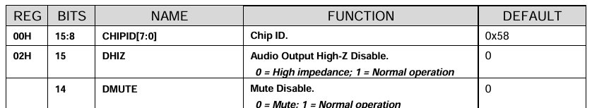
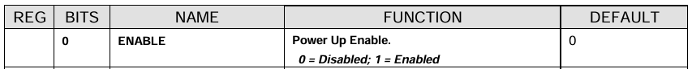

<h1 align = "center"> ESP32 FM Radio Project Version 1 </h1>

  This is the first version of the project. The goal was simple: <b> get the radio working. </b> The frequency is hardcoded in the code, meaning the radio automatically tunes to KISS 91.7 when powered on. <i>No buttons, no controls, just plug in and it plays.</i>

<h2> What I learned </h2>

<h3> Understanding How the ESP32 Configures the RDA5807M </h3> 

 
  The RDA5807M is an independent hardware device with its own internal memory, called registers. When the ESP32 executes functions such as rx.setup(), rx.setFrequency(), and rx.setVolume(), it sends commands over the I²C communication bus to write values into these registers.  
    Once these values are written, they remain stored in the RDA5807M as long as the chip continues to receive power (VCC). This is independent of what the ESP32 is doing afterward. The ESP32 can run different code, stop communicating, or even be disconnected (provided the RDA5807M has its own power supply), and the RDA5807M will continue using the last settings stored in its registers. 
  
  For example, if the ESP32 configures the RDA5807M to tune to 91.7 MHz, sets the volume to 1, and unmutes the audio, the radio will continue operating with those settings until:  
    <ul>
      <li>The ESP32 writes new values to the registers, or</li>
      <li>The RDA5807M loses power, causing its registers to reset to their default state.</li>
    </ul>
    

<h3>What rx.setup() actually does:</h3>

  Before understanding what <code>rx.setup()</code> does, we first need to understand 
  the <b>default state</b> of the RDA5807M chip before we configure it. 
  According to the datasheet, the chip powers on with these default register values:

<b><i>According to the RDA5807M datasheet:</i></b>

<i>
  Register 0x02, bit 14: DMUTE = 0 by default, which means the chip starts 
  in a <b>muted state</b> — no audio output until we tell it otherwise.
</i>
  

<i>
  Register 0x02, bit 0: ENABLE = 0 by default, which means the chip is 
  <b>powered down</b> on startup — it needs to be explicitly enabled before it does anything.
</i>
  

<i>
  Register 0x05, bits [3:0] represent volume. 0000 = 0 (minimum), 1111 = 15 (maximum). 
  The <b>default is 1111 (maximum volume)</b> — so if we powered the chip on without 
  setting the volume, it would play at full blast.
</i>
  

  So by default, the chip starts <b>muted, powered down, and at maximum volume</b>. 
  These defaults are not useful on their own — the chip needs to be configured 
  by the ESP32 before it does anything meaningful. This is what <code>rx.setup()</code> is for.

<b><i>According to the source: PU2CLR RDA5807 Arduino Library</i></b>

<pre><code>
void RDA5807::setup(uint8_t clock_frequency, uint8_t oscillator_type, uint8_t rlck_no_calibrate)
{
    this->oscillatorType = oscillator_type;
    this->clockFrequency = clock_frequency;
    this->rlckNoCalibrate = rlck_no_calibrate;
    
    Wire.begin();
    delay(10);
    powerUp();
    delay(this->maxDelayAftarCrystalOn);
}
</code></pre>

  When you call <code>rx.setup()</code>, it does these things in order:
  <ol>
    <li>
      <code>Wire.begin()</code>: Initializes the I2C communication line between 
      the ESP32 and the RDA5807M chip. Without this, the ESP32 cannot talk to 
      the chip at all — no commands can be sent.
    </li>
    <li>
      <code>delay(10)</code>: Waits 10 milliseconds for the I2C bus to stabilize before sending any commands.
    </li>
    
    <li>
      <code>powerUp()</code>: This is where the actual chip configuration happens. It writes new values into the chip's registers, overriding the factory defaults. Here is what <code>powerUp()</code> actually does internally:
    </li>
    
  </ol>

<pre><code>
void RDA5807::powerUp()
{
    reg02->raw = 0;
    reg02->refined.NEW_METHOD = 0;
    reg02->refined.RDS_EN = 0;        // RDS disable
    reg02->refined.CLK_MODE = this->clockFrequency;
    reg02->refined.RCLK_DIRECT_IN = this->oscillatorType;
    reg02->refined.NON_CALIBRATE = this->rlckNoCalibrate;
    reg02->refined.MONO = 1;          // Force mono
    reg02->refined.DMUTE = 1;         // Normal operation (unmuted)
    reg02->refined.DHIZ = 1;          // Normal operation (audio output enabled)
    reg02->refined.ENABLE = 1;        // Power up the chip
    reg02->refined.BASS = 1;          // Enable bass boost
    reg02->refined.SEEK = 0;
    setRegister(REG02, reg02->raw);
    
    reg05->raw = 0x00;
    reg05->refined.INT_MODE = 0;
    reg05->refined.LNA_PORT_SEL = 2;
    reg05->refined.LNA_ICSEL_BIT = 0;
    reg05->refined.SEEKTH = 8;        // 0b1000
    reg05->refined.VOLUME = 0;        // Set volume to minimum
    setRegister(REG05, reg05->raw);
}
</code></pre>

  The key things <code>powerUp()</code> changes from the factory defaults:
  <ul>
    
    <li>
      <b>ENABLE = 1</b>: Powers the chip on. By default, ENABLE = 0, so the chip was completely powered down. This is what actually turns the receiver on.
    </li>
    
    <li>
      <b>DMUTE = 1</b>: Unmutes the chip. By default, DMUTE = 0 (muted). After powerUp(), the chip is unmuted and ready to output audio.
    </li>
    
    <li>
      <b>DHIZ = 1</b>: Enables the audio output pins. Without this, the audio output is in a high-impedance state — no signal would reach the PAM8403 amplifier.
    </li>
    
    <li>
      <b>VOLUME = 0</b>: Overrides the default maximum volume (1111) and sets it to minimum (0000). 
      <b>Important note: volume = 0 does NOT mean true silence.</b> 
      The chip still outputs a small signal at volume 0 that the PAM8403 amplifies to an audible level. True silence requires <code>rx.setMute(true)</code>, which sets DMUTE = 0.
    </li>
  </ul>

  <b>Important consequence:</b> Since <code>powerUp()</code> sets DMUTE = 1 (unmuted), calling <code>rx.setup()</code> will leave the chip in an unmuted state. This is why we immediately follow <code>rx.setup()</code> with <code>rx.setMute(true)</code> in our code — to keep the radio silent until the user intentionally turns it on by pressing the button.

  <i>
    Overall, <code>rx.setup()</code> initializes I2C communication between the ESP32 and RDA5807M, powers the chip on, unmutes it, enables the audio output, and sets the volume to minimum — taking the chip from its powered-down factory default state to a fully operational but silent state, ready to receive commands.

    
  </i>

  <b>One more important thing about register memory:</b> All these settings are stored in the chip's <b>volatile RAM</b> — temporary memory that only holds while power is supplied. When you unplug the circuit, all settings reset to factory defaults. This is why the ESP32 needs to run rx.setup() and configure the chip every single time it powers on — it cannot remember the previous settings across power cycles.

